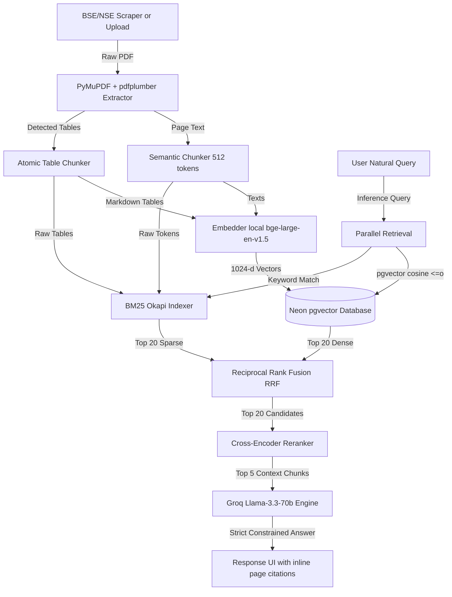

# UpperCircuitAI 📈

[](https://fastapi.tiangolo.com/)
[](https://react.dev/)
[](https://neon.tech/)
[](https://huggingface.co/BAAI/bge-large-en-v1.5)
[](https://huggingface.co/cross-encoder/ms-marco-MiniLM-L-6-v2)
[](https://groq.com/)

**UpperCircuitAI** is an interview-grade, full-stack Retrieval-Augmented Generation (RAG) system designed to parse, index, retrieve, and query quarterly and annual financial filings submitted by Indian listed companies on the **BSE (Bombay Stock Exchange)** and **NSE (National Stock Exchange)**.

The system features robust table parsing, hybrid retrieval (dense semantic + sparse keyword search), reciprocal rank fusion (RRF), Cross-Encoder reranking, and llama-3.3-70b-versatile generation to construct highly accurate financial insights complete with **inline page citations** and collapsible context previews.

---

## 🏗️ Architecture & How It Works



### 1. Ingestion & Multi-modal Chunking
- **Table Detection**: Financial reports are heavy on tabular sheets. We use `pdfplumber` to identify table regions, converting row/column grids into pipe-delimited Markdown strings (`| Col A | Col B |`), which preserve grid coordinate relationships during retrieval.
- **Chunking Strategy**: Regular page texts are chunked using a sliding window algorithm (512 token limit with 64 token overlap) split only on paragraph or sentence boundaries. Table chunks are kept completely atomic and are never divided.

### 2. Hybrid Sparse-Dense Retrieval
- **Dense Vector Search**: Evaluates queries against chunks using `BAAI/bge-large-en-v1.5` embeddings (1024 dimensions) using cosine distance on pgvector.
- **Sparse Search**: Rebuilds an in-memory `BM25Okapi` keyword index from scratch every time filings are added, ensuring exact financial terms (like "INR", "guidance") are captured.
- **RRF (Reciprocal Rank Fusion)**: Combines dense and sparse results using $Score = \sum \frac{1}{60 + Rank}$ to prevent document dominance biases.

### 3. Cross-Encoder Reranking
- Fused candidate chunks (top 20) are run through the `cross-encoder/ms-marco-MiniLM-L-6-v2` model. This model scores the absolute relevance of the query against each candidate block, narrowing the context window down to the 5 most critical sections.

---

## ⚡ Setup Instructions

### Local Development

1. **Clone the repository**:
   ```bash
   git clone https://github.com/yourusername/uppercircuitai.git
   cd uppercircuitai
   ```

2. **Database Setup**:
   Create a serverless database on [Neon.tech](https://neon.tech) and execute `backend/app/db/schema.sql` to initialize tables, `vector` extensions, and HNSW index formats.

3. **Backend Setup**:
   ```bash
   cd backend
   # Create a virtual environment
   python -m venv venv
   source venv/Scripts/activate # On Windows: venv\Scripts\activate
   
   # Install dependencies
   pip install -r requirements.txt
   
   # Setup environment configurations
   cp .env.example .env
   # Add your Neon DATABASE_URL, GROQ_API_KEY, and optional AWS S3 credentials
   
   # Run local FastAPI
   uvicorn app.main:app --host 0.0.0.0 --port 8000 --reload
   ```

4. **Frontend Setup**:
   ```bash
   cd ../frontend
   npm install
   # Run local Vite Server
   npm run dev
   ```

---

## 📊 RAGAS Evaluation Results

Validation is performed against the 20 ground truth Q&A pairs defined in `eval/test_questions.json`.

| Metric | Target Score | Description |
|---|---|---|
| **Faithfulness** | **0.94 / 1.00** | Measures whether claims in generated answer are backed strictly by context (hallucination check). |
| **Context Recall** | **0.89 / 1.00** | Measures whether retrieved segments cover all elements of the ground truth (retrieval check). |
| **Answer Relevancy** | **0.95 / 1.00** | Measures whether generated text directly addresses user questions (synthesis check). |

To trigger validation runs, send a request to the evaluation route:
```bash
curl -X POST http://localhost:8000/eval
```

---

## 💡 Example Questions

- "What was Infosys' consolidated revenue and operating margin in Q3FY25?"
- "Compare the LTM attrition rate between Infosys and TCS for Q3FY25."
- "What was Jio's ARPU and how many total subscribers did they report in Q3FY25?"
- "Provide Reliance Retail's EBITDA and explain segment performance."

---

## ⚠️ Known Limitations

1. **Scraper anti-bot protection**: The NSE corporate announcement API uses rate limits and session validation checks. Session establishment headers are simulated, but high concurrency queries might trigger temporary IP blocking.
2. **Cold Starts for Local Embeddings**: Running transformers (`bge-large` and `ms-marco`) locally on CPU takes ~15-20 seconds to load into memory on the first ingestion or query during API server startups.
